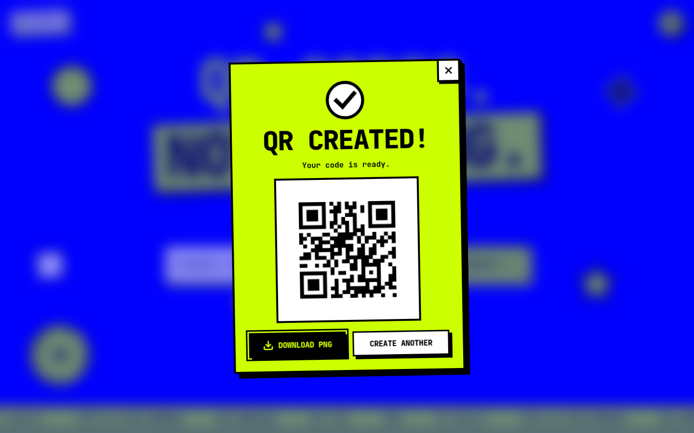
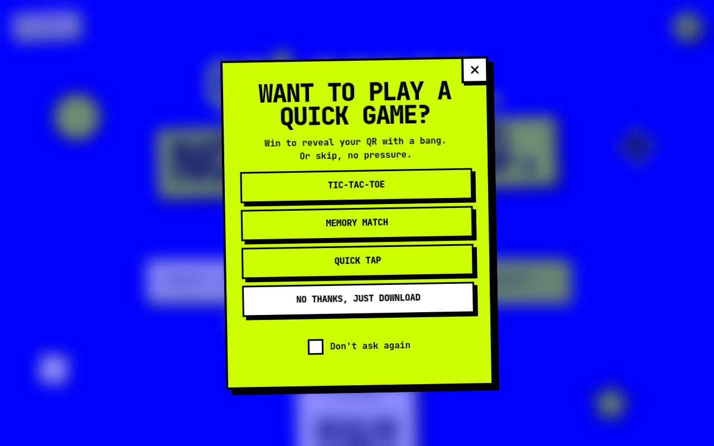
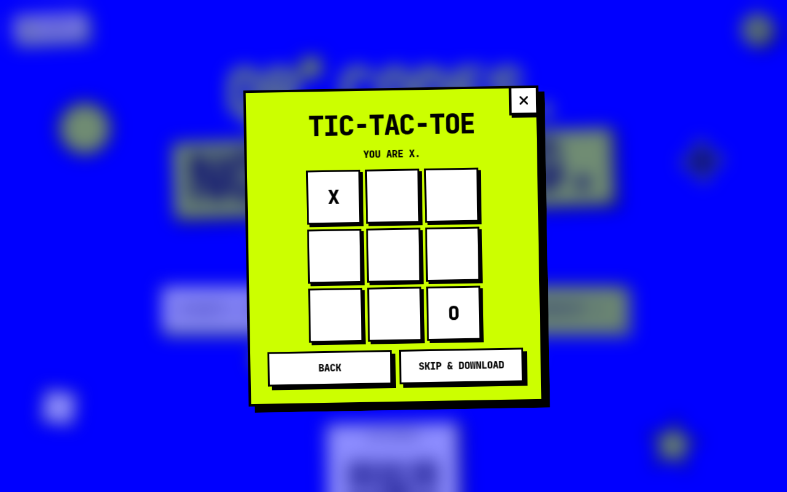
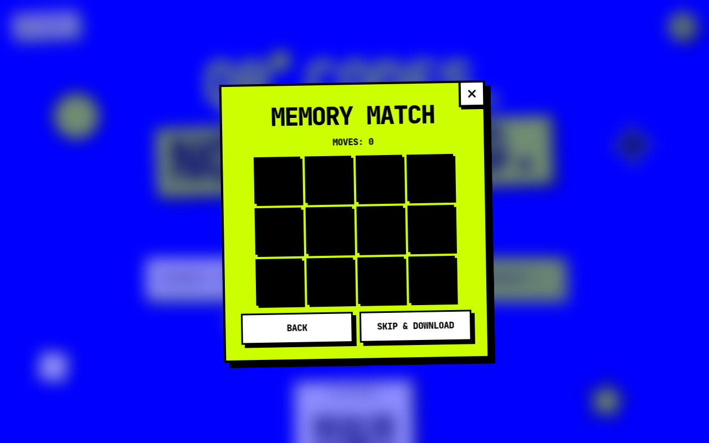
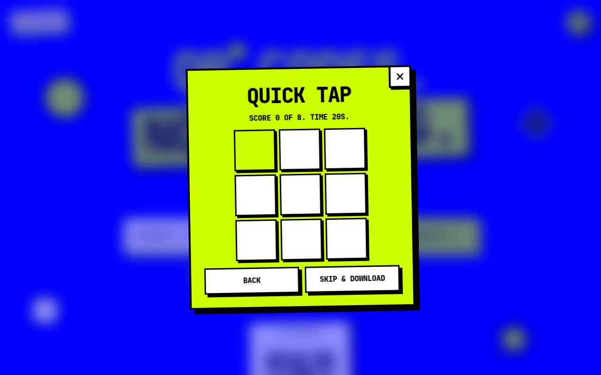

# QR Code Generator & Designer

A browser-only tool for making QR codes. Choose a content type, adjust the style, and download a PNG at the exact pixel size you picked. Nothing is sent to a server.

Live demo: https://qr-gen-henna-five.vercel.app


## Setup

You need Node.js 22 or newer.

```bash
npm install
npm run dev
```

Open the address Vite prints, usually http://localhost:5273.

```bash
npm test
npm run build
```

`npm test` runs the unit tests. `npm run build` writes the static site to `dist/`.

## Features

- One screen: a headline, one big input with a Generate button, and chips for the type (URL, Text, Email, Phone, Wi-Fi). Email and Wi-Fi expand extra fields under the chips. Each type keeps its own inputs when you switch.
- A live preview appears under the form as soon as the input is valid, and a smaller one sits at the top of the settings drawer. Both redraw as you type and as you change any setting.
- Generate is greyed out until the input is valid. Clicking it early shakes the bar and says what is wrong.
- Clicking Generate runs a short "creating" loader, then offers an optional mini-game: Tic-tac-toe, Memory match, or Quick tap. Skip, or turn mini-games off in settings, and the result modal opens with the QR code, a Download PNG button and Create another. Close it with the X, Escape, or a click outside. Focus stays inside the modal and returns to Generate when it closes.
- A settings drawer (the round button, top right) holds size (128 to 1024 px), foreground and background color, a gradient, error correction (L, M, Q, H), margin (0 to 10 modules), module pattern (square, rounded, dots, diamond) and an optional center logo, plus six presets, night mode and the recent list.
- PNG and SVG download, named `qr-<type>-<YYYYMMDD-HHmmss>.png` or `.svg`. Copy puts the PNG on the clipboard. The default pattern is square, with no gradient and no logo.
- Scan warnings in the modal for low contrast, inverted colors, a small size, a short quiet zone, and a long payload on a small code. Warnings do not block the download.
- Content that is too long for a QR code is caught after the loader, with a message under the input.
- Up to 10 recent codes, saved in this browser only when you press Generate, restored or deleted from the drawer. Wi-Fi passwords are hidden in the list.

## Design decisions

The look is neo-brutalist: four colors only (blue `#0000FF`, lime `#CCFF00`, black, white), 3px black borders, and hard offset shadows with no blur. Buttons lift on hover and sink on press. Black shadows and borders are close to invisible on the blue page, so the input bar, the logo sticker and the idle chips use lime or white instead. The QR code is always drawn on a white card.

The panels (drawer and modal) are lime or white, so their focus ring is black. Everywhere else it is a 3px white outline. With `prefers-reduced-motion` on, the marquee, floating shapes, rotating badge, confetti and spring pop are replaced by simple fades.

The QR code is drawn on a canvas, one whole pixel per module edge, and the PNG is that same canvas. The SVG download is the same modules as vectors. Rounded, dot and diamond patterns leave the three corner eyes square. A logo sits in the center on a pad of the background color.

`boostLevel` is turned off. Otherwise the library can raise the error-correction level above the one you selected.

While the loader runs, a hidden copy of the QR code tries to encode the payload. If it throws, the app shows the "too long" message instead of opening the modal.

Presets are dark marks on a light background, each with a contrast ratio of at least 4:1, so every preset can be scanned. Contrast uses the WCAG relative-luminance formula.

Recent codes are stored as data, not images, under the key `qr-generator:recent:v1`. A Wi-Fi password is stored so the entry can be restored, and the list shows "password hidden" instead of the password. Reads and writes are wrapped so a full disk or broken saved data does not crash the page.

All text uses JetBrains Mono, loaded from Google Fonts in `index.html`.

## Deploy

The production build is a static `dist/` folder. On Vercel or Netlify, set the build command to `npm run build` and the output directory to `dist`. No environment variables are required.

## Credits

- [Cursor](https://cursor.com).
- [qrcode.react](https://github.com/zpao/qrcode.react) for drawing the codes. It bundles the Nayuki QR Code generator.
- [Lucide](https://lucide.dev) for the icons.
- [JetBrains Mono](https://www.jetbrains.com/lp/mono/), served by [Google Fonts](https://fonts.google.com/specimen/JetBrains+Mono).
- [React](https://react.dev) and [Vite](https://vite.dev).

## Screenshots

Home screen on desktop:


The same screen at a phone width:


The result modal after pressing Generate:



The optional game offer:



Tic-tac-toe, Memory match, and Quick tap:






