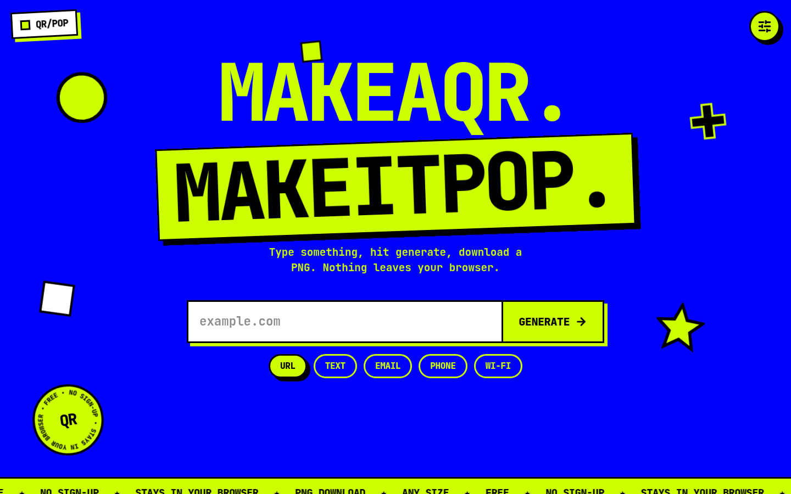
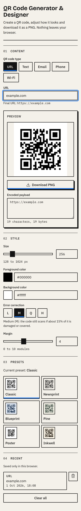

# QR Code Generator & Designer

A browser-only tool for making QR codes. Choose a content type, adjust the style, and download a PNG at the exact pixel size you picked. Nothing is sent to a server.



## Setup

You need Node.js 22 or newer.

```bash
npm install
npm run dev
```

Open the address Vite prints, usually http://localhost:5273.

```bash
npm test
npm run build
```

`npm test` runs the unit tests. `npm run build` writes the static site to `dist/`.

## Features

- Content types: URL, text, email, phone, and Wi-Fi. Each type keeps its own inputs when you switch.
- The preview and the encoded payload update as you type. Invalid input shows a dashed placeholder instead of a code.
- Style: size (128 to 1024 px), foreground and background color, error correction (L, M, Q, H), and margin (0 to 10 modules).
- Six presets. Editing a preset's colors, level, or margin switches the label to Custom. Size is not part of a preset.
- PNG download at the selected size, named `qr-<type>-<YYYYMMDD-HHmmss>.png`. The button stays disabled until the code can be drawn.
- Field errors appear after you type or leave a field. They say what is wrong.
- Scan warnings for low contrast, inverted colors, a small size, a short quiet zone, and a long payload on a small code. Warnings do not block the download.
- Up to 10 recent codes, saved in this browser only, restored or deleted from the list. Wi-Fi passwords are hidden in the list.

## Design decisions

The page is laid out like a printed spec sheet: numbered sections, a 12-column guide on wide screens, flat color, and a hard offset shadow on the preview card and the download button. The only accent is blue, used for focus, the selected state, and the bar on the download button. The button face stays paper-colored so the label stays easy to read.

The QR code is drawn on a canvas. `qrcode.react` scales that canvas by the screen's pixel density, so a direct export would not match the size you chose. The download copies the canvas onto a new one of the selected size, then saves that file.

`boostLevel` is turned off. Otherwise the library can raise the error-correction level above the one you selected.

Presets are dark marks on a light background, each with a contrast ratio of at least 4:1, so every preset can be scanned. Contrast uses the WCAG relative-luminance formula.

Recent codes are stored as data, not images, under the key `qr-generator:recent:v1`. A Wi-Fi password is stored so the entry can be restored, and the list shows "password hidden" instead of the password. Reads and writes are wrapped so a full disk or broken saved data does not crash the page.

Fonts are self-hosted with `@fontsource`: JetBrains Mono 400, 500, and 700.

## Deploy

The production build is a static `dist/` folder. On Vercel or Netlify, set the build command to `npm run build` and the output directory to `dist`. No environment variables are required.

## Credits

- [qrcode.react](https://github.com/zpao/qrcode.react) for drawing the codes. It bundles the Nayuki QR Code generator.
- [Lucide](https://lucide.dev) for the icons.
- [JetBrains Mono](https://www.jetbrains.com/lp/mono/), loaded through [@fontsource](https://fontsource.org).
- [React](https://react.dev) and [Vite](https://vite.dev).

## Screenshots

Desktop, with a URL code and the Classic preset:


The same page at a phone width. The preview sits directly under the content fields.


